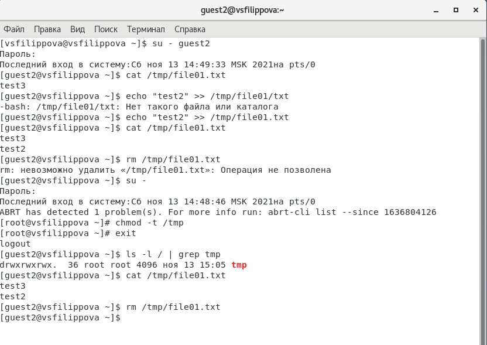

---
## Front matter
lang: ru-RU
title: Лабораторная работа №5
author: |
	Филиппова Вероника Сергеевна - студентка группы НКНбд-01-18
date: 13.11.2021

## Formatting
toc: false
slide_level: 2
theme: metropolis
header-includes:
 - \metroset{progressbar=frametitle,sectionpage=progressbar,numbering=fraction}
 - '\makeatletter'
 - '\beamer@ignorenonframefalse'
 - '\makeatother'
aspectratio: 43
section-titles: true
---

# Дискреционное разграничение прав в Linux. Исследование влияния дополнительных атрибутов

## Цель выполнения лабораторной работы

Изучение механизмов изменения идентификаторов, применения SetUID- и Sticky-битов. Получение практических навыков работы в консоли с дополнительными атрибутами. Рассмотрение работы механизма
смены идентификатора процессов пользователей, а также влияние бита Sticky на запись и удаление файлов

## Задачи выполнения работы

1) Создание программы.
2) Исследование Sticky-бита

## Результаты выполнения лабораторной работы. Часть 1

От имени суперпользователя выполнила команды: `chown root:guest /home/guest/simpleid2` и `chmod u+s /home/guest/simpleid2`. 
Первая команда изменяет права на файл с guest на root. А затем устанавливает атрибут SetUID, который запускает программу не с правами пользователя, а с правами владельца файла.
Выполнила  проверку изменений с помощью команды `ls -l simpleid2`

{ #fig:001 width=70% }

## Результаты выполнения лабораторной работы. Часть 2

Узнала, установлен ли атрибут Sticky на директории /tmp, для чего выполнил команду `ls -l / | grep tmp`

{ #fig:002 width=70% }

## Результаты выполнения лабораторной работы. Часть 3

Повысила свои права до суперпользователя  командой `su -` и выполнила команду, снимающую атрибут t (Sticky-бит) сдиректории /tmp: `chmod -t /tmp`

{ #fig:003 width=70% }

## Выводы

Изучила механизмы изменения идентификаторов, применения SetUID- и Sticky-битов. 
Получила практические навыки работы в консоли с дополнительными атрибутами. 
Рассмотрела работу механизма смены идентификатора процессов пользователей, а также влияние бита
Sticky на запись и удаление файлов.