---
# Front matter
title: "Информационная безопасность."
subtitle: "Лабораторная работа №5."
author: "Филиппова Вероника Сергеевна."

# Generic otions
lang: ru-RU
toc-title: "Содержание"

# Bibliography

# Pdf output format
toc: true # Table of contents
toc_depth: 2
lof: true # List of figures
lot: true # List of tables
fontsize: 12pt
linestretch: 1.5
papersize: a4
documentclass: scrreprt
## I18n
polyglossia-lang:
  name: russian
  options:
  - spelling=modern
  - babelshorthands=true
polyglossia-otherlangs:
  name: english
### Fonts
mainfont: PT Serif
romanfont: PT Serif
sansfont: PT Sans
monofont: PT Mono
mainfontoptions: Ligatures=TeX
romanfontoptions: Ligatures=TeX
sansfontoptions: Ligatures=TeX,Scale=MatchLowercase
monofontoptions: Scale=MatchLowercase,Scale=0.9
## Biblatex
biblatex: true
biblio-style: "gost-numeric"
biblatexoptions:
  - parentracker=true
  - backend=biber
  - hyperref=auto
  - language=auto
  - autolang=other*
  - citestyle=gost-numeric
## Misc options
indent: true
header-includes:
  - \linepenalty=10 # the penalty added to the badness of each line within a paragraph (no associated penalty node) Increasing the value makes tex try to have fewer lines in the paragraph.
  - \interlinepenalty=0 # value of the penalty (node) added after each line of a paragraph.
  - \hyphenpenalty=50 # the penalty for line breaking at an automatically inserted hyphen
  - \exhyphenpenalty=50 # the penalty for line breaking at an explicit hyphen
  - \binoppenalty=700 # the penalty for breaking a line at a binary operator
  - \relpenalty=500 # the penalty for breaking a line at a relation
  - \clubpenalty=150 # extra penalty for breaking after first line of a paragraph
  - \widowpenalty=150 # extra penalty for breaking before last line of a paragraph
  - \displaywidowpenalty=50 # extra penalty for breaking before last line before a display math
  - \brokenpenalty=100 # extra penalty for page breaking after a hyphenated line
  - \predisplaypenalty=10000 # penalty for breaking before a display
  - \postdisplaypenalty=0 # penalty for breaking after a display
  - \floatingpenalty = 20000 # penalty for splitting an insertion (can only be split footnote in standard LaTeX)
  - \raggedbottom # or \flushbottom
  - \usepackage{float} # keep figures where there are in the text
  - \floatplacement{figure}{H} # keep figures where there are in the text
---

# Цель работы

Изучение механизмов изменения идентификаторов, применения SetUID- и Sticky-битов. Получение практических навыков работы в консоли с дополнительными атрибутами. Рассмотрение работы механизма
смены идентификатора процессов пользователей, а также влияние бита Sticky на запись и удаление файлов

# Задание

1) Создание программы.
2) Исследование Sticky-бита

# Выполнение лабораторной работы

## Создание программы

Проверила версию gcc с помощью программы `gcc -v`

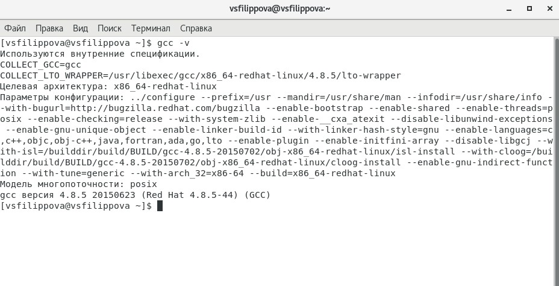{ #fig:001 width=70% }

Отменила на текущую сессию SELinux командой `setenforce 0`
Вошла в систему от имени пользователя guest, создала программу `simpleid.c`

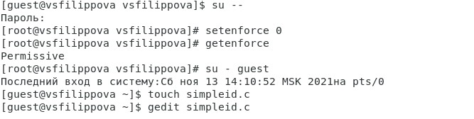{ #fig:002 width=70% }

Скомпилировала программу и убедилась, что файл программы создан, командой `gcc simpleid.c -o simpleid`

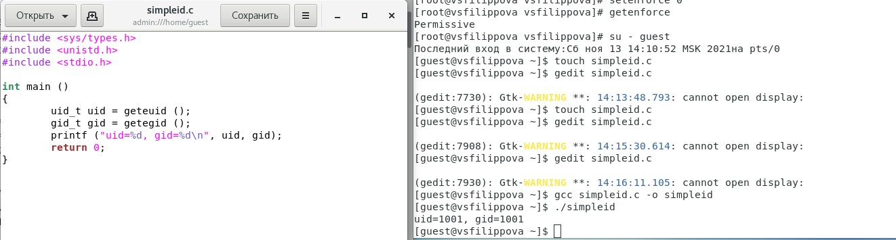{ #fig:003 width=70% }

Выполнила программу simpleid: `./simpleid` и программу `id` и сравнила полученный результат с данными предыдущего пункта. 
Полученные значения id совпадают

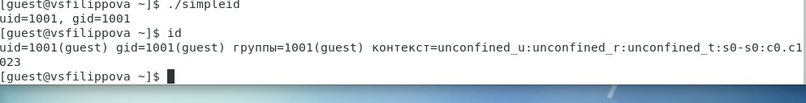{ #fig:004 width=70% }

Усложнила программу, добавив вывод действительных идентификаторов, назвала программу `simpleid2.c`
Скомпилировала и запустил simpleid2.c `gcc simpleid2.c -o simpleid2`, а затем `./simpleid2`

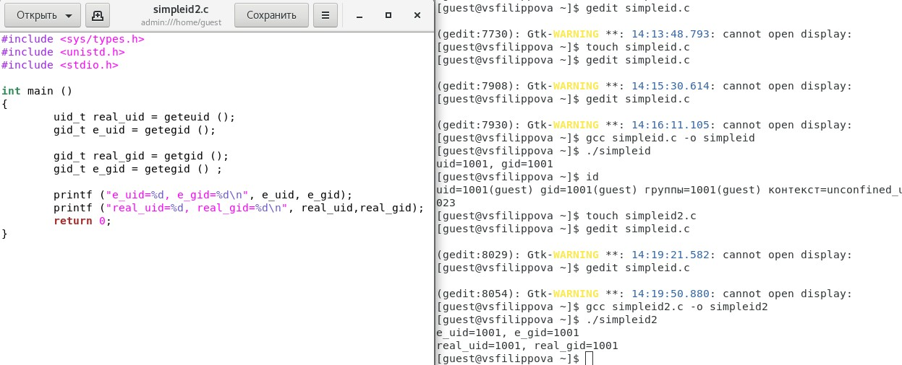{ #fig:005 width=70% }

От имени суперпользователя выполнила команды: `chown root:guest /home/guest/simpleid2` и `chmod u+s /home/guest/simpleid2`. 
Первая команда изменяет права на файл с guest на root. А затем устанавливает атрибут SetUID, который запускает программу не с правами пользователя, а с правами владельца файла.
Затем выполнила  проверку изменений с помощью команды `ls -l simpleid2`

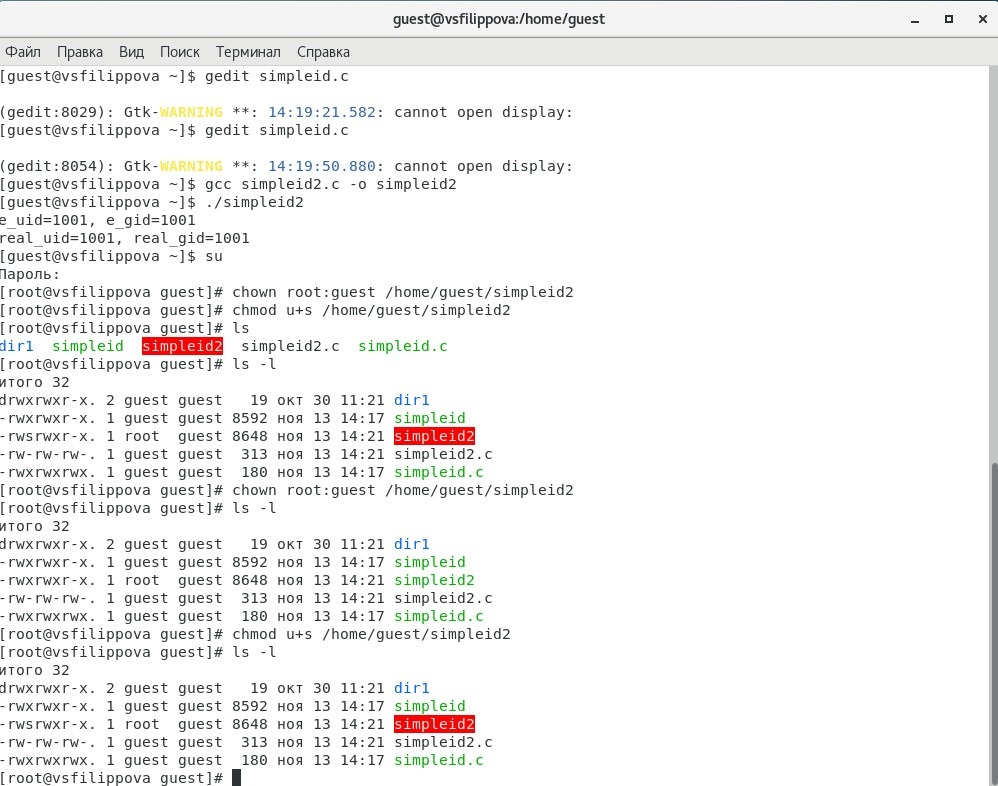{ #fig:006 width=70% }

Запустила `./simpleid2`, `id`. При данном запуске выводы совпадают.

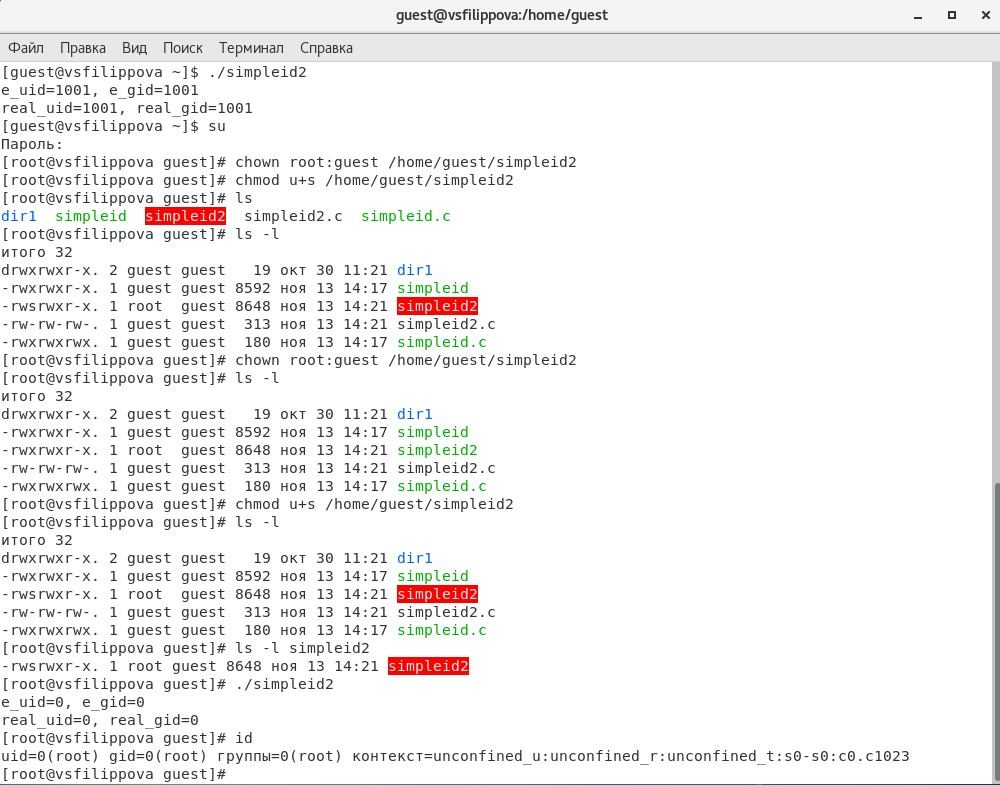{ #fig:007 width=70% }

Проделала то же самое с атрибутом SetGID (установление прав для владеющей группы).

Запустила файл. Теперь выводы для группы различны.

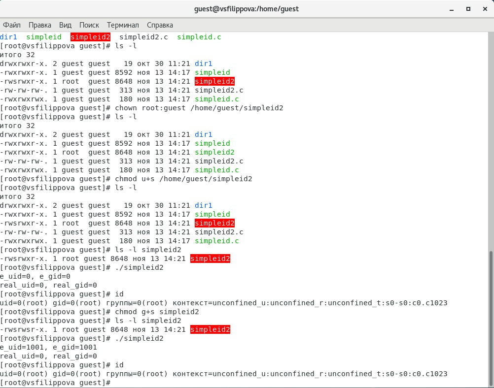{ #fig:008 width=70% }

Создала программу `readfile.c`

Откомпилировала программу: `gcc readfile.c -o readfile`

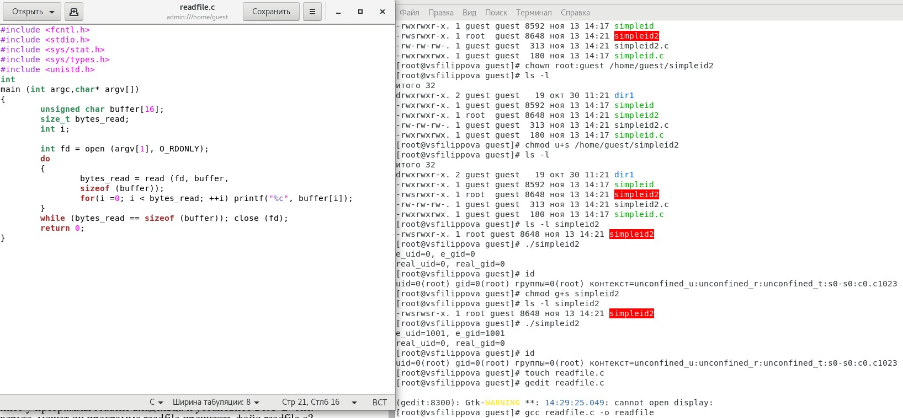{ #fig:009 width=70% }

Сменила владельца у файла readfile.c и изменила права так, чтобы только суперпользователь(root) мог прочитать его.

Проверила, что пользователь guest не может прочитать файл readfile.с

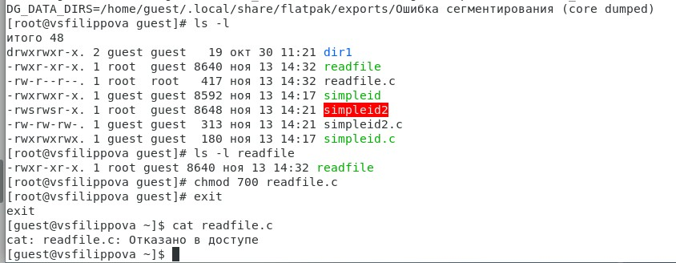{ #fig:010 width=70% }

Сменила у программы readfile владельца и установила SetU’D-бит.

Проверила, может ли программа readfile прочитать файл readfile.c. Да.

Проверила, может ли программа readfile прочитать файл /etc/shadow. Да.

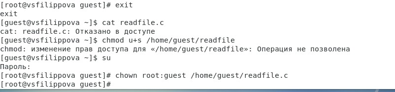{ #fig:011 width=70% }

## Исследование Sticky-бита. 

Узнала, установлен ли атрибут Sticky на директории /tmp, для чего выполнила команду `ls -l / | grep tmp`

От имени пользователя guest создала файл file01.txt в директории /tmp со словом test `echo "test" > /tmp/file01.txt`

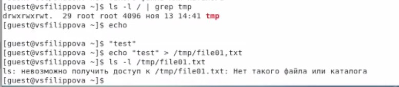{ #fig:012 width=70% }

Просмотрела атрибуты у только что созданного файла и разрешила чтение и запись для категории пользователей «все остальные»: 

1. `ls -l /tmp/file01.txt`, 
2. `chmod o+rw /tmp/file01.txt`, 
3. `ls -l /tmp/file01.txt`

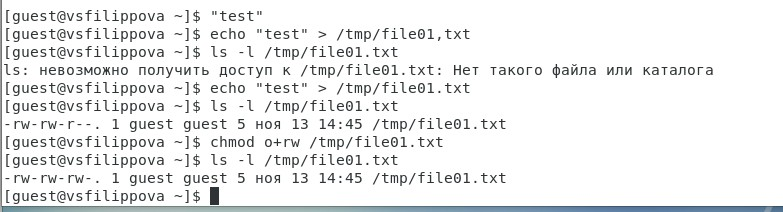{ #fig:013 width=70% }

От пользователя guest2 (не являющегося владельцем) попробовала прочитать файл /tmp/file01.txt: `cat /tmp/file01.txt`

Попробовала записать в файл `/tmp/file01.txt` слово test3, стерев при этом всю имеющуюся в файле информацию командой
`echo "test3" > /tmp/file01.txt`

Попробовала дозаписать в файл `/tmp/file01.txt` слово test2 командой `echo "test2" >> /tmp/file01.txt`

Проверила содержимое файла командой `cat /tmp/file01.txt`

 с
директории /tmp: `chmod -t /tmp`

![Рисунок 16](../scr/16.png{ #fig:016 width=70% }

Повысила свои права до суперпользователя и вернула атрибут `t` на директорию /tmp: `su -`, `chmod +t /tmp`, `exit`

![Рисунок 17](../scr/17.png{ #fig:017 width=70% }

# Выводы

Изучила механизмы изменения идентификаторов, применения SetUID- и Sticky-битов. 
Получила практические навыки работы в консоли с дополнительными атрибутами. 
Рассмотрела работу механизма смены идентификатора процессов пользователей, а также влияние бита
Sticky на запись и удаление файлов.